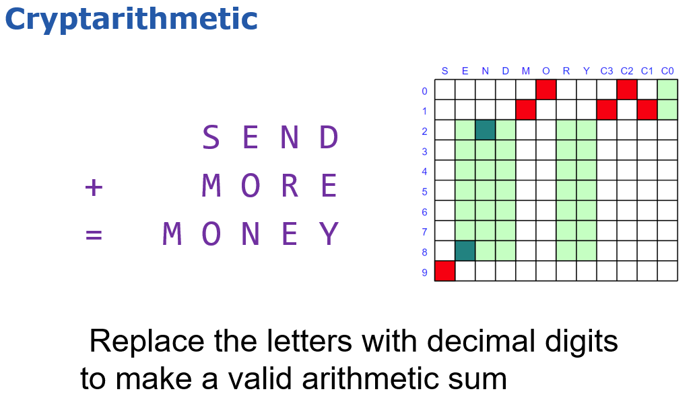
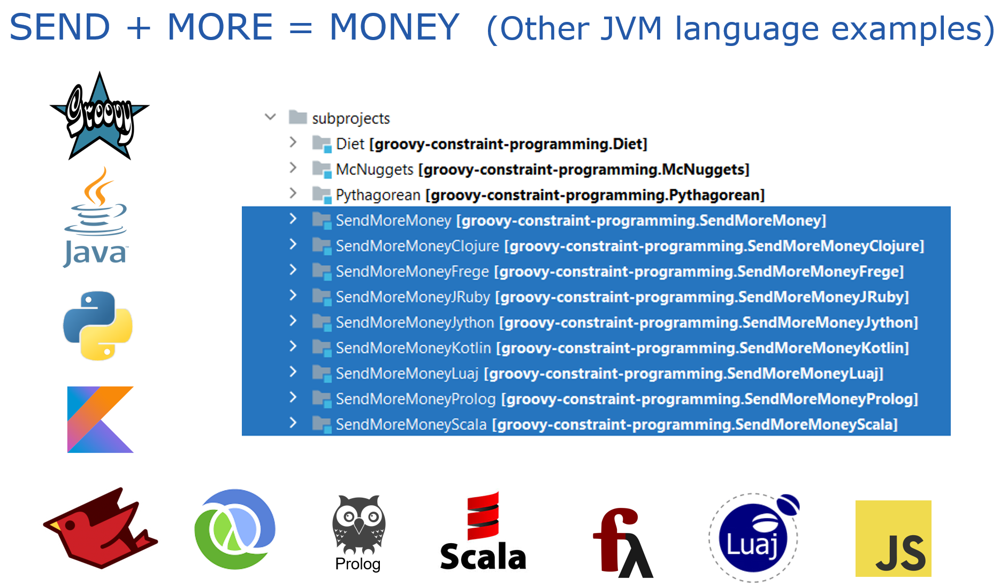

# Cryptarithmetic

This subproject is part of a repo illustrating [constraint programming](../..).
This subproject illustrates solving a fairly simple cryptarithmetic puzzle
using naive brute force, permutations, and constraint-programming with Choco.

---

## The problem



---

## The solutions

Examples for this problem are also provided for
[Clojure](https://clojure.org/),
Haskell ([Frege](https://github.com/Frege/frege)),
[Java](https://www.java.com/),
JavaScript ([Nashorn](https://docs.oracle.com/javase/10/nashorn/)),
Ruby ([JRuby](https://www.jruby.org/)), 
Python ([Jython](https://www.jython.org/)),
[Kotlin](https://kotlinlang.org/),
Lua ([Luaj](https://github.com/luaj/luaj)),
Prolog ([tuprolog](http://apice.unibo.it/xwiki/bin/view/Tuprolog/)),
and [Scala](https://www.scala-lang.org/).



## Running the examples

You have the following options to run the examples:

* [running locally](../../docs/RunningLocal.md) on the command-line (see below) or in an IDE
* [running via gitpod](../../docs/RunningGitpod.md)
* running as a Jupyter/BeakerX notebook [](https://mybinder.org/v2/gh/paulk-asert/groovy-constraint-programming/master?filepath=subprojects%2FSendMoreMoney%2Fsrc%2Fmain%2Fnotebook%2FSendMoreMoney.ipynb) ([more details](../../docs/RunningBeakerX.md))
* [running in the Groovy Console or Groovy Web Console](../../docs/RunningConsole.md)

---

### Execution via Gradle

This applies to command-line execution with Gradle either locally or within gitpod, or an IDE that supports Gradle task execution.

Command-line arguments for Gradle to run the Java solution (use `./gradlew` for Unix-like systems):
```
gradlew :SendMoreMoney:run
```

Command-line arguments for Gradle to see the task names for the JavaScript and various Groovy solutions:
```
gradlew :SendMoreMoney:tasks --group="Application"
```
Then pick one of those tasks to run, e.g. to run the Groovy permutations example:
```
gradlew :SendMoreMoney:runSendMoreMoneyPermutations
```

For the other languages, choose the appropriate subproject and arguments:
```
gradlew :SendMoreMoneyClojure:tasks --group="Application"
gradlew :SendMoreMoneyFrege:tasks --group="Application"
gradlew :SendMoreMoneyJRuby:tasks --group="Application"
gradlew :SendMoreMoneyJython:tasks --group="Application"
gradlew :SendMoreMoneyKotlin:run
gradlew :SendMoreMoneyLuaj:tasks --group="Application"
gradlew :SendMoreMoneyProlog:run
gradlew :SendMoreMoneyScala:run
```
Typically `run` is used if there is only one example, otherwise you will have to
pick one of the run tasks returned by the `tasks` command.
